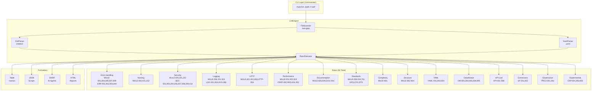
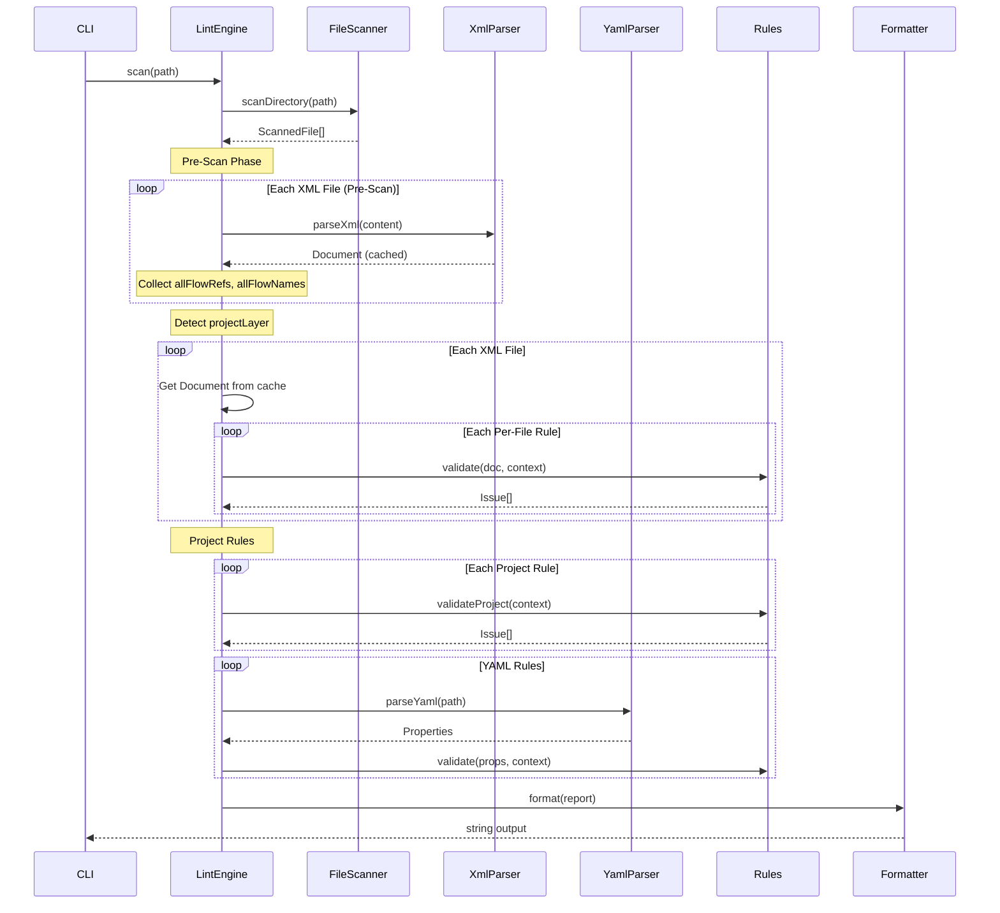
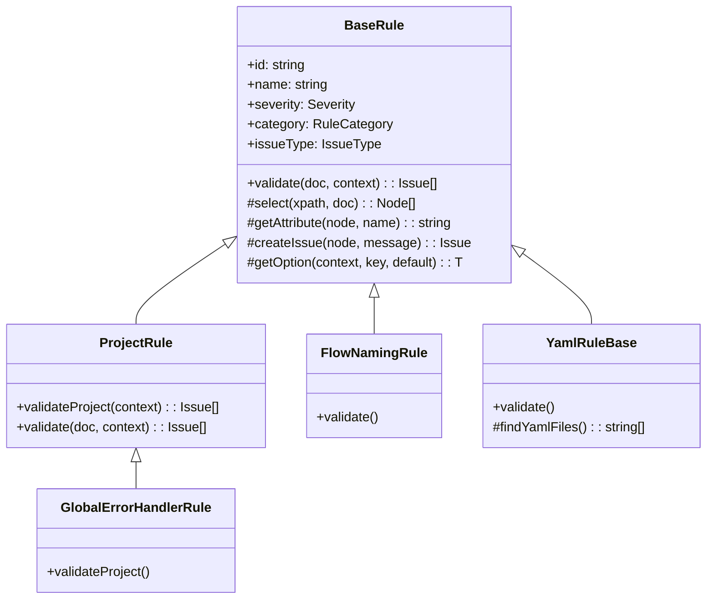

# Architecture

This document describes the architecture, design patterns, and best practices used in mule-lint.

## System Overview



## Data Flow



## Core Components

### LintEngine

The central orchestrator that:

1. Scans directories for XML and YAML files using FileScanner
2. **Pre-scans** all XML files to collect cross-file metadata (`allFlowRefs`, `allFlowNames`, `projectContext` with `projectLayer`)
3. **Caches** parsed XML `Document` objects to avoid redundant parsing
4. Executes all enabled per-file rules against each cached document
5. Executes project-level rules (`ProjectRule` subclasses) once per scan
6. Aggregates results into a LintReport

```typescript
const engine = new LintEngine({ rules: ALL_RULES, config });
const report = await engine.scan('./project');
```

#### Document Cache

During `preScanFiles()`, the engine parses each XML file and stores the resulting `Document` in an internal `Map<string, Document>`. When `processFile()` runs, it retrieves the cached document instead of re-parsing. The cache is cleared after each scan to free memory.

#### Project Layer Detection

The engine automatically classifies projects into a `ProjectLayer`:

| Layer     | Detection Heuristic                                         |
| --------- | ----------------------------------------------------------- |
| `sapi`    | Directory name contains `-sapi`, `-sys-`, or `-system-`     |
| `papi`    | Directory name contains `-papi`, `-proc-`, or `-process-`   |
| `eapi`    | Directory name contains `-eapi`, `-exp-`, or `-experience-` |
| `library` | Directory name contains `-library`, `-lib`, or `-common`    |
| `batch`   | Batch job elements detected in XML files                    |
| `unknown` | Default when no pattern matches                             |

Available to rules via `context.projectContext?.projectLayer`.

### XPathHelper

Singleton utility for namespace-aware XPath queries:

```typescript
const xpath = XPathHelper.getInstance();
const flows = xpath.selectNodes('//mule:flow', document);
```

Pre-configured namespaces:

| Prefix        | Namespace                                         |
| ------------- | ------------------------------------------------- |
| `mule`        | http://www.mulesoft.org/schema/mule/core          |
| `http`        | http://www.mulesoft.org/schema/mule/http          |
| `ee`          | http://www.mulesoft.org/schema/mule/ee/core       |
| `db`          | http://www.mulesoft.org/schema/mule/db            |
| `doc`         | http://www.mulesoft.org/schema/mule/documentation |
| `tls`         | http://www.mulesoft.org/schema/mule/tls           |
| `file`        | http://www.mulesoft.org/schema/mule/file          |
| `sftp`        | http://www.mulesoft.org/schema/mule/sftp          |
| `vm`          | http://www.mulesoft.org/schema/mule/vm            |
| `jms`         | http://www.mulesoft.org/schema/mule/jms           |
| `apikit`      | http://www.mulesoft.org/schema/mule/mule-apikit   |
| `batch`       | http://www.mulesoft.org/schema/mule/batch         |
| `netsuite`    | http://www.mulesoft.org/schema/mule/netsuite      |
| `sap`         | http://www.mulesoft.org/schema/mule/sap           |
| `anypoint-mq` | http://www.mulesoft.org/schema/mule/anypoint-mq   |
| `oauth`       | http://www.mulesoft.org/schema/mule/oauth         |

### BaseRule

Abstract base class providing utilities to all rules:



**Issue Types for Quality Metrics:**

- `code-smell` (default) - Maintainability issues
- `bug` - Reliability issues (error-handling rules)
- `vulnerability` - Security issues (security rules)

## Design Patterns

### Strategy Pattern (Rules)

Each rule is a strategy implementing the same interface:

```typescript
interface Rule {
  id: string;
  name: string;
  severity: Severity;
  validate(doc: Document, context: ValidationContext): Issue[];
}
```

### Factory Pattern (Formatters)

Formatters are selected via factory function:

```typescript
function getFormatter(type: FormatterType): Formatter {
  switch (type) {
    case 'table':
      return formatTable;
    case 'json':
      return formatJson;
    case 'sarif':
      return formatSarif;
    case 'html':
      return formatHtml;
  }
}
```

### Singleton Pattern (XPathHelper)

XPathHelper uses singleton to avoid recreating namespace resolver:

```typescript
XPathHelper.getInstance(); // Same instance always
```

## Directory Structure

```
src/
├── index.ts              # Package entry point
├── types/                # TypeScript interfaces
│   ├── Rule.ts          # Rule, Issue, Severity, IssueType, ProjectLayer
│   ├── Report.ts        # LintReport, FileResult
│   └── Config.ts        # LintConfig, CliOptions
├── core/                 # Core utilities
│   ├── XPathHelper.ts   # Namespace-aware XPath (16 namespaces)
│   ├── XmlParser.ts     # DOM parsing
│   ├── YamlParser.ts    # YAML parsing
│   ├── FileScanner.ts   # File discovery
│   ├── ComplexityCalculator.ts
│   └── MetricsAggregator.ts  # Quality rating calculations
├── quality/              # Quality scoring system
│   ├── index.ts         # Module exports
│   ├── types.ts         # Rating types and interfaces
│   ├── thresholds.ts    # A-E rating boundaries
│   └── calculator.ts    # Rating calculation functions
├── engine/               # Orchestration
│   └── LintEngine.ts    # Main engine (document cache, pre-scan, project layer)
├── rules/                # All rules (82 total)
│   ├── index.ts         # Rule registry (ALL_RULES array)
│   ├── base/            # BaseRule + ProjectRule classes
│   ├── api-led/         # API-001–004, API-006–008
│   ├── complexity/      # MULE-801
│   ├── connector/       # SF-001, SF-002
│   ├── dataweave/       # DW-001–005
│   ├── documentation/   # MULE-601, 604, DOC-001
│   ├── error-handling/  # MULE-001,003,005,007,009, ERR-001–004
│   ├── experimental/    # EXP-001–003
│   ├── governance/      # PROJ-001, PROJ-002
│   ├── http/            # MULE-401–403, HTTP-004
│   ├── logging/         # MULE-006,301,303, LOG-001,004, HYG-001
│   ├── naming/          # MULE-002, 101, 102
│   ├── operations/      # HYG-002–005
│   ├── performance/     # MULE-501–503, PERF-002, RES-001–002
│   ├── security/        # MULE-004,201,202, SEC-002–004,006–010
│   ├── standards/       # MULE-008,010,701, OPS-001–003, API-005, CFG-001–002, STD-001
│   ├── structure/       # MULE-802–804
│   └── yaml/            # YAML-001, 003, 004
└── formatters/           # Output formatters
    ├── TableFormatter.ts
    ├── JsonFormatter.ts
    ├── SarifFormatter.ts
    ├── CsvFormatter.ts
    ├── HtmlFormatter.ts  # Orchestrates HTML report
    └── html/             # Modular HTML components
        ├── components/   # RatingBadge, Modal, etc.
        ├── sections/     # Header, Sidebar, QualityRatings
        ├── views/        # Dashboard, IssuesView
        ├── scripts/      # Client-side JS (renderer, router)
        └── styles/       # CSS modules and badges
```

## Rule Categories

| Category       | ID Prefix                       | Count | Description                                    |
| -------------- | ------------------------------- | ----- | ---------------------------------------------- |
| Error Handling | MULE-00X, ERR-001–004           | 9     | Error handler configuration and best practices |
| Naming         | MULE-002, 10X                   | 3     | Flow, variable, and file naming                |
| Security       | MULE-004, 20X, SEC-002–010      | 11    | Hardcoded values, TLS, credentials             |
| Logging        | MULE-006, 30X, LOG, HYG-001     | 6     | Logger configuration and hygiene               |
| HTTP           | MULE-40X, HTTP-004              | 4     | HTTP request configuration                     |
| Performance    | MULE-50X, PERF-002, RES-001–002 | 6     | Performance anti-patterns and resilience       |
| Documentation  | MULE-60X, DOC-001               | 3     | Component documentation                        |
| Standards      | MULE-008,010,70X, OPS, CFG, STD | 10    | Best practices and operations                  |
| Complexity     | MULE-801                        | 1     | Cyclomatic complexity                          |
| Structure      | MULE-80X                        | 3     | Project structure                              |
| YAML           | YAML-XXX                        | 3     | Properties validation                          |
| DataWeave      | DW-XXX                          | 5     | DWL file validation                            |
| API-Led        | API-XXX                         | 7     | API-Led patterns                               |
| Connectors     | SF-001, SF-002                  | 2     | Salesforce and event connector rules           |
| Governance     | PROJ-XXX                        | 2     | POM and Git hygiene                            |
| Experimental   | EXP-XXX                         | 3     | Beta rules                                     |

## Extension Points

### Adding Rules

1. Create class extending `BaseRule`
2. Implement `validate()` method
3. Register in `src/rules/index.ts`
4. Add documentation to `docs/rules-catalog.md`

### Adding Formatters

1. Create function implementing formatter interface
2. Add to factory in `src/formatters/index.ts`
3. Update `FormatterType` in types

## Error Handling

- **Parse Errors**: Captured and reported, don't stop scan
- **Rule Errors**: Caught and logged, continue with next rule
- **File Errors**: Reported in results, continue scanning

## Performance Specifications

| Metric              | Target          |
| ------------------- | --------------- |
| Files per second    | > 100           |
| Memory per file     | < 10MB          |
| Rule execution      | < 50ms per rule |
| Total for 100 files | < 5 seconds     |

## Exit Codes

| Code | Meaning                        |
| ---- | ------------------------------ |
| 0    | No errors or warnings          |
| 1    | At least one error found       |
| 2    | Configuration error            |
| 3    | Critical error (parse failure) |
